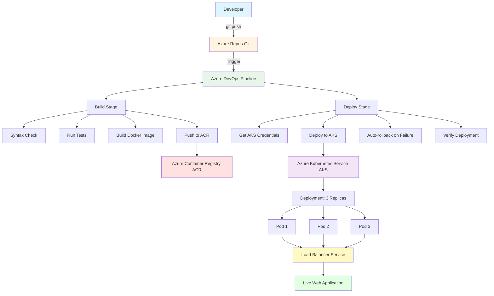

# Flask App - CI/CD Pipeline Demo

A Flask application with user authentication and comments system, deployed to Azure Kubernetes Service (AKS) via Azure DevOps CI/CD pipeline.

## Features

- User authentication (login/logout)
- Comment system with timestamps
- Portfolio page
- SQLite database (Kubernetes-friendly)
- Auto-rollback on deployment failure

## Prerequisites

- Python 3.11+
- Docker
- Azure account with:
  - Azure Container Registry (ACR)
  - Azure Kubernetes Service (AKS)
  - Azure DevOps project

## Local Development

### Setup

```bash
# Install dependencies
pip install -r requirements.txt

# Run the application
python flask_app.py
```

## CI/CD Pipeline

### Pipeline Stages

1. **Build Stage**
   - Syntax check (`python -m compileall .`)
   - Run tests (pytest)
   - Build Docker image
   - Push to Azure Container Registry (ACR)

2. **Deploy Stage**
   - Get AKS credentials
   - Deploy to AKS
   - Auto-rollback on failure (10-minute timeout)
   - Verify deployment

### Branch Structure

- **main**: Stable, production-ready pipeline
- **cicd-demo**: Development branch with syntax checks and enhanced features

### Triggered Branches

The pipeline triggers on:
- `main`
- `cicd-demo/*`

## Deployment

### Manual Deployment

```bash
# Build image
docker build -t mytask.azurecr.io/flask-app:latest .

# Push to ACR
az acr login --name mytask
docker push mytask.azurecr.io/flask-app:latest

# Deploy to AKS
kubectl set image deployment/flaskapp flaskapp=mytask.azurecr.io/flask-app:latest
```

### Kubernetes Manifests

- `deployment.yaml.k8s` - Deployment configuration
- `service.yaml.k8s` - Service configuration (LoadBalancer)

## Architecture

- **Flask**: Web framework
- **Flask-Login**: User authentication
- **SQLite**: Database
- **Azure DevOps**: CI/CD pipeline
- **AKS**: Container orchestration
- **ACR**: Container registry

# CI/CD Architecture Diagram

## Mermaid Diagram (for visualization tools)


KEY FEATURES:
- Syntax Check: Catches errors before build
- Auto-rollback: Reverts failed deployments
- 3 Replicas: High availability
- Load Balancer: External access
- Automated CI/CD: Git push triggers pipeline

## Pipeline Features

- **Syntax checking**: Catches Python syntax errors before deployment
- **Automated testing**: Runs pytest if test files exist
- **Image tagging**: Uses Git SHA + Build ID for unique image tags
- **Auto-rollback**: Automatically rolls back if deployment fails
- **Timeout handling**: 10-minute timeout for rollout status

## Troubleshooting

### Deployment Timeout

If deployment times out:
1. Check pod status: `kubectl get pods`
2. View pod logs: `kubectl logs <pod-name>`
3. Describe pod: `kubectl describe pod <pod-name>`

### Syntax Errors

The pipeline will fail at the syntax check stage if there are Python syntax errors. Fix the errors and push again.

### Build Stage Failed


### Build and Deploy Stage Passed


